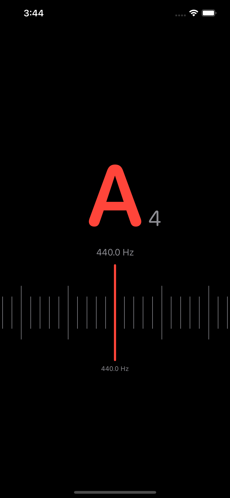
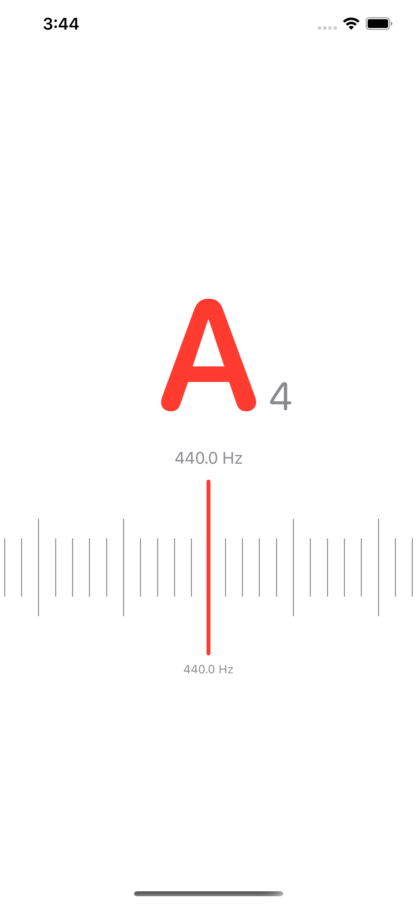
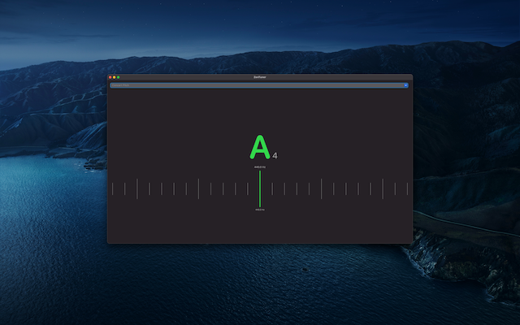
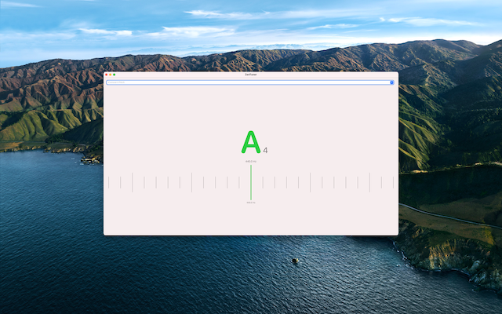

# Zen Tuner

A minimal chromatic tuner for iOS, watchOS, macOS & visionOS. Works well with
any instrument, whether it’s woodwinds, brass, strings or voice.

|       | Dark                                | Light                                |
| ----- | ----------------------------------- | ------------------------------------ |
| iOS   |    |    |
| macOS |  |  |

## Features

* Beautiful, clean and simple interface
* Large current note representation and a high marker that change from
  red to green when the note is in tune
* One-touch menu to apply a transposition to easily tune all instruments
* Tap the main note to adjust preference to prefer sharps or flats
* Works well on all screen sizes and orientations, from the smallest
  Apple Watch to the largest iPad or Mac

## Credits

* [AudioKit][audiokit] powers the audio analysis for this tuner
* Design inspired by the [Stuner App][stuner] mockups by [Célio Silva][celio]
* The audio files used for tests were generated from the [FatBoy][fatboy]
  sound font and released under the
  [Creative Commons Attribution Share-Alike 3.0][cc] license

## License

MIT.

[audiokit]: https://audiokit.io
[stuner]: https://www.behance.net/gallery/77749403/Stuner-App
[celio]: https://www.behance.net/celiosilva
[fatboy]: https://fatboy.site
[cc]: https://creativecommons.org/licenses/by-sa/3.0/
